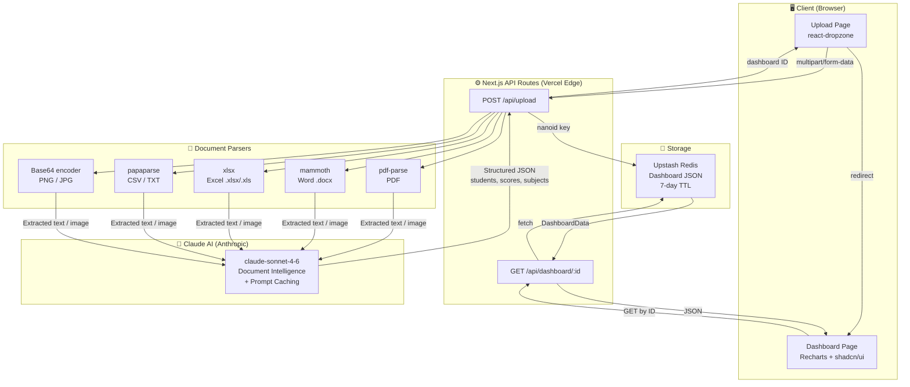
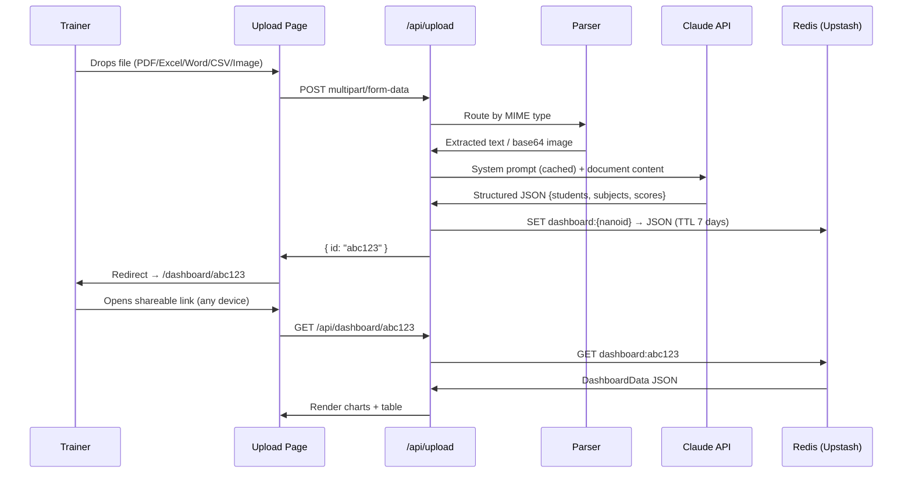
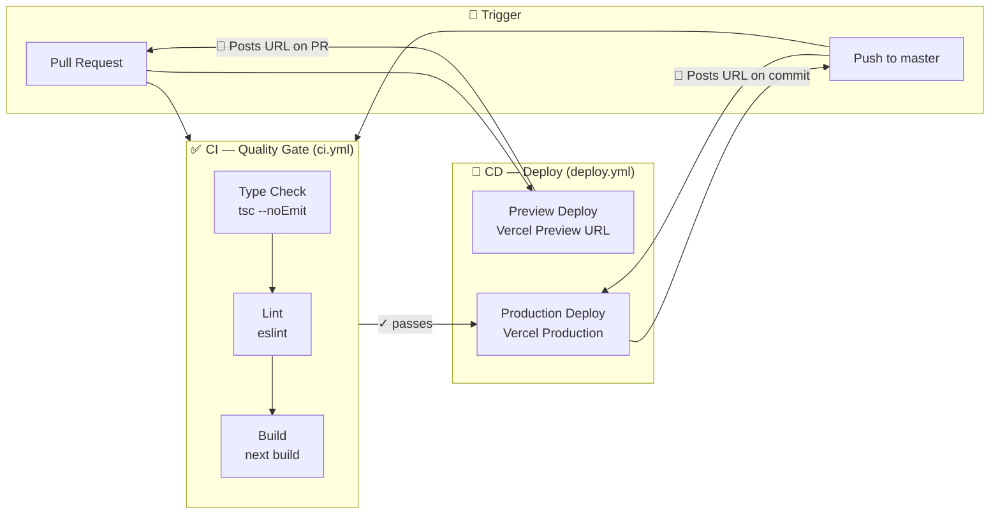

<div align="center">

# 🎓 Smart Dashboard

### AI-Powered Student Analytics — Upload Any Document, Get Instant Insights

[](https://nextjs.org)
[](https://www.typescriptlang.org)
[](https://anthropic.com)
[](https://tailwindcss.com)
[](https://vercel.com)
[](https://upstash.com)
[](https://github.com/DevMLAI01/smart-dashboard/actions/workflows/ci.yml)
[](https://github.com/DevMLAI01/smart-dashboard/actions/workflows/deploy.yml)

**A one-stop solution for trainers and educators** — upload a mark sheet, attendance record, or any student performance document and instantly generate a rich, interactive analytics dashboard with a shareable link. No login required.

</div>

---

## 🎯 The Problem

Trainers and educators manage student performance data scattered across **Excel sheets, PDFs, Word documents, and handwritten scans**. Turning that raw data into meaningful insights requires:
- Manual copy-paste into spreadsheet tools
- Hours building charts and reports
- No easy way to share results with stakeholders

**Smart Dashboard eliminates all of that in under 10 seconds.**

---

## ✨ Demo

### Upload Flow
```
Trainer uploads file  →  Claude AI extracts data  →  Dashboard generated  →  Shareable link ready
      < 1s                     3–8s                      instant                  7-day link
```

### Dashboard View

```
┌──────────────────────────────────────────────────────────────────────┐
│  🎓 Smart Dashboard  /  Python Batch 2025          [Share Dashboard] │
├─────────────┬────────────────────────────────────────────────────────┤
│  SUBJECTS   │  📊 30 Students   📈 Avg: 74%   ✅ Pass: 90%   📚 4   │
│             ├───────────────────────┬────────────────────────────────┤
│ ◉ All       │  Grade Distribution  │  Attendance Overview           │
│ ○ Maths     │  ████████████        │  ─────────────────────         │
│ ○ Science   │  ████ ████           │  ──────────────────            │
│ ○ English   │  ██ ████ ██          │  ────75%─────────────          │
│ ○ History   ├───────────────────────┼────────────────────────────────┤
│             │  🏆 Top Performers   │  Subject Breakdown             │
│  30 students│  🥇 James A.  99     │  Math  ████████████  74        │
│             │  🥈 Carol W.  95     │  Sci   ██████████    78        │
│             │  🥉 Grace L.  89     │  Eng   █████████     76        │
│             ├───────────────────────┴────────────────────────────────┤
│             │  Student Records    🔍 Search...                        │
│             │  # │ Name          │ Math │ Sci │ Eng │ Hist │ Avg    │
│             │  1 │ Alice Johnson │  88  │ 92  │ 79  │ 85  │  86    │
│             │  2 │ Bob Smith     │  64  │ 71  │ 83  │ 70  │  72    │
└─────────────┴────────────────────────────────────────────────────────┘
```

---

## 🏗️ Architecture



### Data Flow Detail



---

## 📊 Supported Document Formats

| Format | Parser | Use Case |
|---|---|---|
| **PDF** | `pdf-parse` | Grade reports, printouts, scanned PDFs |
| **Word (.docx)** | `mammoth` | Mark sheets, trainer reports |
| **Excel (.xlsx/.xls)** | `xlsx` | Structured grade books |
| **CSV** | `papaparse` | Data exports from LMS/SIS |
| **Plain Text (.txt)** | native | Attendance lists, pasted data |
| **PNG / JPG** | Claude Vision | Photos of handwritten sheets, scanned images |

---

## 📈 Dashboard Analytics

| Widget | Chart Type | What It Shows |
|---|---|---|
| **Stat Cards** | KPI tiles | Total students, average score, pass rate, subject count |
| **Grade Distribution** | Bar chart | Score range buckets (0–39, 40–49 … 90–100) |
| **Attendance Overview** | Line chart | Attendance % per student with 75% threshold line |
| **Top Performers** | Ranked list | Top 5 🥇🥈🥉 + bottom 3 needing attention |
| **Subject Breakdown** | Grouped bar | Avg score & pass % per subject side-by-side |
| **Student Table** | Searchable table | All students, all subjects, per-subject scores, colour-coded |

> **Subject filter** in the sidebar filters all charts simultaneously to a single subject.

---

## 💼 Business Impact

| Before | After |
|---|---|
| Trainer manually builds Excel pivot tables | Upload once → dashboard in < 10 seconds |
| Reports take 30–60 minutes to produce | Fully automated — zero manual work |
| Results shared as static PDFs | Live shareable URL, always up-to-date |
| Data locked to one person's laptop | Accessible from any device, any location |
| No visibility into at-risk students | Bottom performers surfaced automatically |
| Subject-level gaps invisible | Per-subject breakdown highlights weak areas |

### Key Metrics

- ⏱️ **Time to insight:** < 10 seconds from upload to dashboard
- 📂 **Format coverage:** 7 file types — no conversion needed
- 🔗 **Shareability:** Zero-friction link sharing (no login, no install)
- 🧠 **AI accuracy:** Claude extracts students, scores, and attendance from unstructured documents including handwritten scans
- 💰 **Cost per dashboard:** ~$0.002–0.005 in Claude API tokens (cached system prompt)
- 📅 **Link lifetime:** 7 days (configurable via Redis TTL)

---

## 🛠️ Tech Stack

```
Frontend          Next.js 16 · TypeScript · Tailwind CSS 4 · shadcn/ui
Charts            Recharts
File Upload       react-dropzone
AI Engine         Claude claude-sonnet-4-6 via @anthropic-ai/sdk (prompt caching enabled)
Document Parsing  pdf-parse · mammoth · xlsx · papaparse
Storage           Upstash Redis (REST API, 7-day TTL per dashboard)
IDs               nanoid (10-char URL-safe)
Deployment        Vercel (serverless, 60s function timeout)
```

---

## 🚀 Getting Started

### Prerequisites
- Node.js 18+
- An [Anthropic API key](https://console.anthropic.com)
- An [Upstash Redis](https://console.upstash.com) database (free tier works)

### 1. Clone & Install

```bash
git clone https://github.com/DevMLAI01/smart-dashboard.git
cd smart-dashboard
npm install
```

### 2. Configure Environment

```bash
cp .env.local.example .env.local
```

Edit `.env.local`:

```env
ANTHROPIC_API_KEY=sk-ant-...
UPSTASH_REDIS_REST_URL=https://your-db.upstash.io
UPSTASH_REDIS_REST_TOKEN=your-token-here
```

### 3. Run Locally

```bash
npm run dev
```

Open [http://localhost:3000](http://localhost:3000)

---

## ☁️ Deploy to Vercel

### One-click deploy

[](https://vercel.com/new/clone?repository-url=https://github.com/DevMLAI01/smart-dashboard)

### Manual deploy

```bash
npm i -g vercel
vercel
```

Add these environment variables in the Vercel dashboard under **Project → Settings → Environment Variables**:

| Variable | Where to get it |
|---|---|
| `ANTHROPIC_API_KEY` | [console.anthropic.com](https://console.anthropic.com) |
| `UPSTASH_REDIS_REST_URL` | [console.upstash.com](https://console.upstash.com) → Database → REST API |
| `UPSTASH_REDIS_REST_TOKEN` | Same as above |

---

## 📁 Project Structure

```
smart-dashboard/
├── app/
│   ├── page.tsx                        # Upload landing page
│   ├── layout.tsx                      # Root layout
│   ├── dashboard/[id]/
│   │   ├── page.tsx                    # Server component — fetches from Redis
│   │   ├── DashboardClient.tsx         # Client component — subject filter state
│   │   └── not-found.tsx               # Expired dashboard page
│   └── api/
│       ├── upload/route.ts             # POST — parse → Claude → Redis
│       └── dashboard/[id]/route.ts     # GET — Redis lookup
├── components/
│   ├── upload/
│   │   ├── UploadZone.tsx              # Drag-and-drop + progress states
│   │   └── FormatBadge.tsx             # Accepted format chips
│   ├── dashboard/
│   │   ├── StatCard.tsx                # KPI summary card
│   │   ├── GradeDistribution.tsx       # Score range bar chart
│   │   ├── AttendanceTrend.tsx         # Attendance line chart
│   │   ├── TopPerformers.tsx           # Ranked performers list
│   │   ├── SubjectBreakdown.tsx        # Subject grouped bar chart
│   │   └── StudentTable.tsx            # Searchable student records table
│   └── layout/
│       ├── Header.tsx                  # App header + share button
│       └── Sidebar.tsx                 # Subject filter navigation
├── lib/
│   ├── claude.ts                       # Claude API client + extraction prompt
│   ├── kv.ts                           # Upstash Redis helpers
│   ├── types.ts                        # DashboardData, Student interfaces
│   └── parsers/
│       ├── pdf.ts                      # pdf-parse wrapper
│       ├── word.ts                     # mammoth wrapper
│       ├── excel.ts                    # xlsx wrapper
│       └── image.ts                    # Base64 encoder for Claude Vision
└── .env.local.example                  # Environment variable template
```

---

## 🔬 How Claude Extraction Works

The system prompt instructs Claude to return **only** a structured JSON object — no markdown, no explanation:

```
Given the document content, extract:
  → All student names and IDs
  → Scores per subject (as numbers)
  → Attendance percentages (0–100)
  → A meaningful document title
  → The list of subjects found
  → Document type: marksheet | attendance | mixed

Return raw JSON only. Handle missing fields by omitting them.
```

**Prompt caching** is enabled on the system prompt using `cache_control: { type: "ephemeral" }` — repeated uploads in the same session reuse the cached prompt, reducing latency and cost by ~90%.

---

## ⚙️ CI/CD Pipeline

The project uses **GitHub Actions** for automated quality checks and deployment.

### Pipeline Overview



### Workflows

| Workflow | File | Runs on | Steps |
|---|---|---|---|
| **CI** | `ci.yml` | Every push + PR | `typecheck` → `lint` → `build` |
| **Deploy Preview** | `deploy.yml` | Pull Requests | Build + deploy to Vercel preview URL, posts link on PR |
| **Deploy Production** | `deploy.yml` | Push to `master` | Build + deploy to Vercel production, posts URL on commit |

### Required GitHub Secrets

```
VERCEL_TOKEN          → Vercel personal access token (vercel.com/account/tokens)
VERCEL_ORG_ID         → team_mHbUYlrkZbdGlD2ytK2sYxsU  (already set)
VERCEL_PROJECT_ID     → prj_hC3J1sNt3S3hq23SC50MQMNDQMrV  (already set)
ANTHROPIC_API_KEY     → (already set)
UPSTASH_REDIS_REST_URL   → (already set)
UPSTASH_REDIS_REST_TOKEN → (already set)
```

> **One manual step:** Create a classic token at [vercel.com/account/tokens](https://vercel.com/account/tokens) and add it as `VERCEL_TOKEN`. Full setup guide: [.github/SETUP_SECRETS.md](.github/SETUP_SECRETS.md)

### Setting secrets via CLI

```bash
# Add VERCEL_TOKEN after creating it at vercel.com/account/tokens
gh secret set VERCEL_TOKEN --body "your-token" --repo DevMLAI01/smart-dashboard

# Verify all 6 secrets are present
gh secret list --repo DevMLAI01/smart-dashboard
```

### Run checks locally (same as CI)

```bash
npm run typecheck   # TypeScript check
npm run lint        # ESLint
npm run build       # Production build
```

---

## 🔭 Roadmap

- [ ] **PDF with tables** — better table extraction using Claude's PDF reading capability
- [ ] **Excel multi-sheet** — merge data across multiple sheets
- [ ] **Export dashboard** — download as PDF report
- [ ] **Batch upload** — process multiple class sections at once
- [ ] **Open-source model swap** — plug in Llama 3 / Mistral via Groq (interface already abstracted in `lib/claude.ts`)
- [ ] **Trend comparison** — upload multiple mark sheets and compare across terms
- [ ] **Email share** — send dashboard link directly via email
- [ ] **Custom branding** — add institution logo and colour scheme

---

## 🤝 Contributing

Pull requests are welcome. For major changes, please open an issue first.

```bash
git checkout -b feature/your-feature
git commit -m "Add: your feature"
git push origin feature/your-feature
```

---

## 📄 License

MIT © [DevMLAI01](https://github.com/DevMLAI01)

---

<div align="center">

Built with ❤️ using [Claude AI](https://anthropic.com) · [Next.js](https://nextjs.org) · [Vercel](https://vercel.com)

</div>
